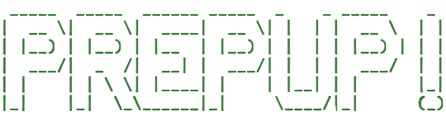

##
## R.I.D.E : Rapid Insights Data Engine

**Tags: [Python] [Streamlit] [Langchain] [OpenAI API] [SoftwareDev] [No-Code]**  

**Links:** [Checkout the Tool](https://neokai.streamlit.app/) | [GitHub]()  

- **R.I.D.E**, RIDE helps you with rapid data prototyping with just few clicks. Upload your dataset, explore multifaceted data analytics, visualize trends, and leverage machine learning, all backed by the power of AI and No-Code environment.

- Quickly Transform Your Data into Insights: With just a few clicks, upload your dataset and dive into a world of comprehensive data exploration. From detailed statistics to exploratory analysis, equip yourself with the tools you need to decode complex data puzzles.

- Machine Learning Simplified: Effortlessly evaluate multiple machine learning models with our Lazypredict integration. Explore a variety of models suitable for both regression and classification tasks, and visualize the outcomes effortlessly.

- Access Cutting-Edge AI Capabilities: Tap into the power of OpenAI's advanced GPT models to effortlessly interpret complex datasets, statistics, and images. Ride enables you to seamlessly integrate these capabilities, transforming intricate data into comprehensible insights with minimal effort.
---

#
## Prepup-Linux : Open-Source Python Package

**Tags: [Polars] [Dask] [Python] [Sklearn] [SoftwareDev]**  

**Links:** [GitHub](https://github.com/sudhanshumukherjeexx/prepup-linux) | [PyPi](https://pypi.org/project/prepup-linux/)  

- **Prepup-Linux**, an open-source package built on the Polars Library, for data inspection, exploration, visualization, and preprocessing tasks directly on the terminal. 
- Supports multiple file formats (**.csv, .excel, .parquet**), ensures data integrity by not altering raw data, and provides efficient feature standardization before model training.

---
#
## GoDaddy Microbusiness Density Forecasting – Kaggle Competition

**Tags: [Time Series Analysis] [Plotly] [CatBoost] [XGBoost] [LightGBM] [ExtraTreesRegressor] [Python]**

**Links:** [Notebook & Code Walkthrough](https://hustledata.substack.com/p/from-underdog-to-top-contender-how) | [Competition](https://www.kaggle.com/competitions/godaddy-microbusiness-density-forecasting)  
  
- Achieved a milestone of being in the **Top 24%** of entire competition notebooks globally and scored a rank of **836 out of 3547 teams**.
- Utilized statistical analysis techniques and implemented Time Series Forecasting models on the [GoDaddy dataset](https://www.kaggle.com/competitions/godaddy-microbusiness-density-forecasting/data), achieving an impressive accuracy of **98.44%** in predicting microbusiness forecasting.
- Leveraged machine learning algorithms including CatBoost, XGBoost, LightGBM, and ExtraTreesRegressor to optimize model performance and deliver robust predictions.

---
#
## Kicking into Insights: Visualizing Soccer Data and Predicting Match Outcomes with PyTorch

  

**Tags: [Data Visualization] [Web Scraping] [Python] [Plotly] [PyTorch] [Multi Classification using Deep Learning]**

**Links:** [View Live Dashboard](https://socceranalytics.streamlit.app/) | [Project Files](https://github.com/sudhanshumukherjeexx/Soccer_Analytics_La_Liga_Data) | [Medium](https://medium.com/@sudhanshumukherjeexx/leveraging-neural-networks-to-predict-la-liga-match-outcomes-multiclass-classification-60f529c8c856)  

- Conducted a study on historical data of the Spanish Soccer League La Liga to analyze all team attributes using extensive visualization using Plotly.
- Trained Neural Networks using PyTorch to predict match outcomes (Wins, Losses, and Draws) based on different features for the Season 2022-2023.
- Created a dashboard that allows users to visualize all the visualized information and derive insights from the data.

---
#
## Insights into Fraudulent Transactions Detection

  

**Tags: [Data Visualization] [XGBoost] [CatBoost] [Plotly] [Statistical Methods]**

**Links:** [View Live Dashboard]() | [GitHub](https://github.com/sudhanshumukherjeexx/American_Express_Deafult_Prediction) | [Dataset](https://www.kaggle.com/c/amex-default-prediction)  

- Explored the effectiveness of machine learning algorithms such as XGBoost, CatBoost, and logistic regression in detecting fraudulent transactions using the American Express Kaggle dataset. Provide insights into the performance of these algorithms and their ability to predict with accuracy.

---

#
## Pizza Shop Database Management
  
  

**Tags: [MySQL] [MongoDB] [ArangoDB] [Neo4j Aura]**

- Developed a comprehensive database management system for a single pizza shop.
- Utilized SQL tool MySQL for relational data storage and management.
- Integrated NoSQL tools such as MongoDB, ArangoDB, and Neo4j to handle diverse data types and optimize specific functionalities.
- Employed indexing and query optimization techniques to enhance system performance and responsiveness.

---
#
## High-Performance Sorting Algorithm - Parallelized

  

**Tags: [Python] [Sorting Algorithms] [Scaling Tests] [Paralleization] [Statistical Methods]**

**Links:** [GitHub](https://github.com/sudhanshumukherjeexx/high_performance_sorting_visualizer)  

- Parallelized sorting algorithms, and performed scaling tests on High Dimensional Data.

# 
